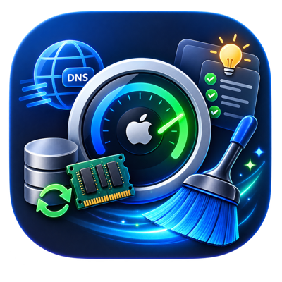

<p align="center">
  
</p>

<h1 align="center">curator</h1>

<p align="center">
  <a href="https://github.com/deluxor/mac-curator/actions/workflows/ci.yml"></a>
  <a href="https://github.com/deluxor/mac-curator/actions/workflows/nightly.yml"></a>
  <a href="https://github.com/deluxor/mac-curator/actions/workflows/links.yml"></a>
  <a href="https://securityscorecards.dev/viewer/?uri=github.com/deluxor/mac-curator"></a>
</p>

A fast, no-nonsense macOS system curator: reclaim RAM, flush DNS, clean
caches/temp files, find duplicates, and surface non-destructive optimization
suggestions.

Written in Rust for speed: directory scans use `jwalk` (parallel walk) and
deletions run across a `rayon` thread pool, so multi-gigabyte cache trees
scan/clean in a fraction of the time a shell script or Finder would take.

## Build

```sh
cargo build --release
# binary at target/release/curator
```

Optionally install it on your PATH:

```sh
cp target/release/curator /usr/local/bin/curator
```

## Commands

| Command | Root? | What it does |
|---|---|---|
| `curator scan` | no | Report RAM, cache, and temp/log sizes. Read-only. |
| `curator memory` | **yes** | Calls `purge` to force the kernel to evict reclaimable/inactive pages. |
| `curator dns` | **yes** | `dscacheutil -flushcache` + `killall -HUP mDNSResponder`. |
| `curator trash [--dry-run] [--yes]` | no | Permanently empties `~/.Trash` plus the per-user Trash on every mounted external volume. |
| `curator clean [--dry-run] [--yes] [--system] [--keep-trash]` | `--system` needs root | Deletes user (and optionally system) caches, stale temp/log files, Mail's downloaded-attachment cache, iOS software update files, Xcode DeviceSupport folders — and empties Trash unless `--keep-trash`. Prompts for confirmation unless `--yes`. |
| `curator suggest` | no | Read-only advisories: oversized Homebrew cache, Xcode DerivedData/Archives, Docker images, iOS backups, Time Machine local snapshots, login item count, Spotlight status, large old Downloads files, possible uninstall leftovers in Application Support. |
| `curator duplicates <path> [--min-size N] [--delete] [--dry-run] [--yes]` | no | Finds duplicate files under `path` via staged BLAKE3 hashing (see Performance below). Reports only unless `--delete`, which removes all but the oldest copy in each group. |
| `curator privacy --browser <safari\|chrome\|firefox\|all> [--history] [--cookies] [--autofill] [--force] [--dry-run] [--yes]` | no | Clears the selected categories via scoped SQL against each browser's own database — never deletes a whole file/profile. Refuses to run against a browser it detects as open unless `--force`. |
| `curator sip-check` | no | Heuristic, read-only: Gatekeeper/SIP status, non-Apple LaunchAgents/LaunchDaemons, suspicious strings in their plists, active crontab entries. Not a signature-based antivirus — a triage list to review, not a verdict. |
| `curator disk verify [volume]` / `curator disk repair [volume] [--yes]` | repair may need admin | Thin wrapper around Apple's own `diskutil verifyVolume`/`repairVolume`. `verify` is read-only; `repair` is gated behind confirm/`--yes` like every other write path. |
| `curator all [--yes]` | recommended: sudo | Runs scan → memory → dns → clean → suggest in one pass. Skips root-gated steps automatically if not run with sudo. Duplicates/privacy/sip-check/disk are standalone — they need a path or explicit flags, so they're not part of `all`. |

## Safety model

- Nothing is deleted without either an explicit `--yes` or an interactive
  confirmation prompt (skipped only for `--dry-run`).
- Cache/temp targets are an explicit allowlist of known-regenerable
  directories (`~/Library/Caches/*`, Xcode DerivedData, CoreSimulator caches,
  `/private/tmp`, log directories) — the tool never walks arbitrary user
  files (Documents, Desktop, Downloads, Photos library, etc.).
- A small denylist inside `~/Library/Caches` protects identity/sync-related
  subdirectories that are unsafe to wipe blindly.
- Temp/log directories are age-filtered (files must be older than N days)
  rather than wiped wholesale, so anything actively in use is left alone.
- `suggest` never deletes anything — it only prints recommendations and the
  manual command to run.
- `trash` is real, unrecoverable deletion of items the user already chose to
  delete — still gated behind the same confirm/`--yes`/`--dry-run` flow as
  everything else, never emptied silently.
- `privacy` never has a code path that can touch saved passwords: Chrome's
  `Login Data` and Firefox's `logins.json`/`key4.db` are not in the target
  list at all (not "skipped" — never referenced), Keychain is never called,
  and bookmarks tables are excluded from every DELETE statement. It clears
  data via scoped SQL against known tables, not by deleting whole database
  files, so nothing outside the requested category is touched.
- `disk repair` and `duplicates --delete` follow the same confirm/`--yes`/
  `--dry-run` gate as `clean`. `sip-check` and `disk verify` are pure
  read-only checks — no gate needed because nothing is ever changed.

## Performance notes

- All directory scans (`scan`, `clean`, `suggest`, `duplicates`) use `jwalk`
  for parallel directory traversal instead of a single-threaded walk.
- Deletions run across a `rayon` thread pool.
- `duplicates` avoids hashing whenever it can: files are first bucketed by
  exact size for free (from metadata, zero reads); only files sharing a size
  get a cheap 64KB partial hash; only files that still collide get a full
  BLAKE3 hash (SIMD-accelerated, one of the fastest hash functions
  available). A file with a unique size in the tree is never opened at all.
  Size-buckets are processed in parallel.
- Release builds use LTO, single codegen unit, and `panic = "abort"` for
  smaller/faster binaries.

## Typical usage

```sh
curator scan                              # see what's using space, no root needed
sudo curator all --yes                    # full pass: RAM reclaim, DNS flush, cleanup, suggestions
curator duplicates ~/Downloads --delete   # find & remove duplicate downloads
curator privacy --browser chrome --history --cookies   # clear browsing data (browser must be closed, or pass --force)
curator sip-check                         # quick persistence/Gatekeeper/SIP triage
curator disk verify                       # check the boot volume's filesystem
```
